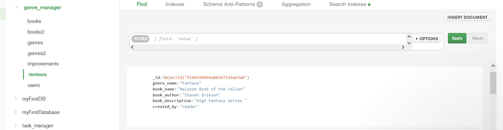

**MS3 README**

## Table of Content

1. [Overview](#overview)

2. [Site Goals](#site-goals)
    1. [UX Goals](#ux-goals)
    2. [Siteowners Goals](#siteowners-goals)
    3. [User Stories](#user-stories)
    4. [Siteowner Stories](#siteowner-stories)

3. [About The Site](#about-the-site)
    1. [Target Audience](#target-audience)

4. [Code Used](#code-used)
    1. [Frameworks](#frameworks)
    2. [Files Made](#files-made)

5. [The Database](#the-database)

6. [Design](#design)
    1. [Typography](#typography)
    2. [Colors](#colors)
    3. [Images](#images)

7. [Code Features](#code-features)

8. [Features to be Added](#features-to-be-added)

9. [Testing](#testing)
    1. [HTML Validation](#html-validation)
    2. [CSS Validation](#css-validation)
    3. [Python Validation](#python-validation)
    4. [Browser Compatibility](#browser-compatibility)
    5. [Devices Tested On](#devices-tested-on)

10. [Deployment](#deployment)

11. [Credits](#credits)
     1. [Icons](#icons)
     2. [Imagery](#imagery)
     3. [CSS Framework](#css-framework)
     4. [JQuery Framework](#jquery-framework)

12. [Acknowledgements](#acknowledgements)

## **Overview**
 - This site was created for MS3 submission for Code Institute.
 - The site's name is Book Recommendations.
 - The source code can be found on GitHub
 - The site is deployed using Heroku

 - The purpose of this site is to help people find books they might like to read in a particular genre, and leave 
   recommendations on books they have read and would recommend. Users can browse the site and read the books in the dropdown menu
   recommendations, but must be logged in to add a review, edit, and delete a review. 

 - There are currently two types of accounts at the moment:

     **Username**: Reader **Password**: Reader
    and 

    **Username**: Admin **Password** Admin
    Both accounts are test accounts used to test site functionality, for example: Reader was used to check if accounts were showing on the Database, and Admin was used to check if only reviews added by admin could be edited by admin.

    View the site [here](https://flask-genres-books.herokuapp.com/)

    ## **Site Goals**

### **UX Goals**

 - Users can create, edit and delete reviews on books they've read, either books recommended on the site or one they've read themselves, and browse recommendations by others.

 - Users can also leave feedback or ask any questions they may have regarding the site.

### **Siteowners Goals**

 - Provide a service that encourages people to read books and genres they may not normally try, and find good books.

 - Ensure the database continues to accept new data, such as: books, reviews, users, and feedback or questions.

 ### **User Stories**

 - As a user of this site I want to find a good book from a variety of genres

 - As a user I want to know my feedback on the site has been submitted.

 - As a user i want to know if my login was successful or not.

 - As a user I want a easy to use, simple site.

 - As a user I want the ability to edit or delete any of my recommendations

### **Siteowner Stories**

 - As the owner of this site, I want to create a easy to use site that serves a purpose.

 -  As the owner of this site, I want users to know their feedback and any questions have been submitted

 -  As the owner of this site, I want users to come back to this site.

 - As the owner of this site, I want users to be able to have control over their reviews, so edit and delete them as well as the ability to create them. 

 - As the owner of this site I want users login details to be stored safely and securely by encrypting the password on the server.

 - As the owner of this site I want users to know their data is secure. 

## **About The Site**

 - The site has a total of 9 pages. Some are only visible to users who are logged in (profile page for example).
 - Users who are logged in have the option to add, edit and delete their reviews, while those who aren't logged in
 - can only browse other people's reviews. The site's purpose is to help people find books they'd like to read, and users can
 - create, edit and delete recommendations/reviews on books they have read. The genres chosen range from the ones that tend to be - more popular among people (Crime and Thriller) and those that aren't (Fantasy and Horror) so that it caters for a wide array 
 - of audiences. 

### **Target Audience**
 - The site is primarily aimed and adults/young adults who are either big readers and want to find thier next book, or people who want to read more but aren't sure what to read.

## **Code Used**

 The site is build using:
 - *HTML* to provide the site's structure and features, for example the contact form.

 - *CSS* to add style to the site, for example the font of the typography.

 - *PYTHON* to add the backend functionality to the site, for example sending data to the database.

 - *JQUERY* to offer interactivity to the site, for example dropdown menus.

### **Frameworks**

 - *MATERIALIZE CSS* is used to help style the site, and add some features to the site using JQUERY. The code used by Materialize is marked. I chose to work with Materialize, as it incorporated bootstrap, that helps with the making the site mobile 
 friendly, and also to challenge myself with learning a new framework. Materialize may help with styling, but there can be some
 speificity issues when using it. For example some issues I had with using it included: trying to size images in the carousel, and the header images on the home and reviews pages. (The former has been resolved, but the latter is still not fullwidth). 

 - *FLASK* is a framework and is used to help with the structuring of Python, and can be seen in the site using the for loops on the homepage that get the books from the server 

 - *Jinja Template* is used to render the templates and write code similar to Python. For example: render_template(signup.html)

### **Files Made**

 - There were 9 HTML files made in this project, 2 python files, a JavaScript file, a CSS file, a Procfile and requirements.txt file. 

 - Most can be viewed on GitHUb, however the env.py file, that was created to connnect the database with the site, contains 
   sensitve information, and has not been pushed to GitHub.

 - The HTML files are stored in the templates folder, as they form the basis of the site, and it helps structure and organise 
   the code. 

 - The static folder contains the JavaScript and CSS files, and is used to help structure the code files, and keep things orderly.

 - The app.py file provides the backend code that handles the data of the site. It is used for submitting data to the database and pulling information from the database. 

 - The env.py file that was created contains information regarding the database and has not been pushed to GitHub.

 ## **The DataBase**

MongoDB is used for the site as it offers a open source document-orientated database. 

- *Structure* The Database has 6 collections described below:

- *Books* This was originally used to contain the books for the site, but due to issues with how the data was displaying on the  site, books2 was created. Books has been left in to show the development of the site.

- 

  
  

- *Books2* This holds the books that are recommended on the site by the site owner and their authors in their correct genre. It is the replacement for books, which had to be discarded due to technical difficulties.

- 

  
  

- *genres* is used to connect the dropdown menus' genres on on the homepage to the ones stored in the database.

- 

  
  

- *genres2* is used in the dropdown menu on the add-review page to connect the genres with the genre field on the form. Due to 
technical difficulties, it wasn't possible to connect the genres collection with the form for some reason, so genres2 was created to keep them seperate, as the site was getting errors, and the genres weren't displaying correctly/ were getting mixed up.

- 

  
  

- *improvements* collection holds information submitted from the contact us page, including email address to contact the person   with and their feedback.

- 

  
  

- *reviews* collection holds the data submitted through the add a review page, this includes, the genre, the name of the book,  
the name of the person who submitted it, the author and the review itself. 

- 

  
  

- *users* holds the information of people who have created accounts to the site. Information collected in this collection on the server includes: username, and their password which can't be read using password_hash encryption. 

- 

  
  

PyMongo is currently used to connect the database with the site, as it is simpler to use than other Python frameworks, and was the one I felt most confident using. Originally MongoEngine was going to be used, but due to the different syntax, the project was getting errors and bugs were everywhere.

## **Design**

The site was designed to have a more relaxed feel to it, and easy to use. The site uses simpe coloring, fonts and imagery to create and achieve this effect. 

### Typography 
- The site uses Oswald font (imported from google fonts) and Roboto (also imported from Google fonts). The reason for these two  fonts is they are becoming increasingly popular amongst web designers, and also lift the site a bit. For example the header's oswald font creates a bold, dark eye catching effect for the header. The nav bar also has a text-shadow applied to it, again using the Materialize CSS framework, ('text-shadow') to help make it stand out and be more readable against the paler blue background.

### Colors 
 - The site uses predominantly blue coloring, and the code used to make it comes from the color classes in the Materialize CSS framework. The navbar uses the class **blue lighten-4** which has the corresponding hex code of: #bbdefb. The dropdown menus uses the Materialize CSS color class of **blue accent-3**, which has the corresponding hexcode of #2979ff. The sites coloring is a softer tone and is designed to be simple, as reading books should be a relaxing task. 

### Images 
- The images used come from pixabay and pexels, and links to the images are used to connect them to their corresponding place on the site. They are chosen with the book genres in mind, so Game of Thrones and Harry Potter for fantasy, and images of dystopian cities for Sci-Fi.

## **Site Features**

Site features on this site are: a navbar, contact form, dropdown menus, a signup form and a login form, and edit reviews form.  

### **NavBar**

- Is used to offer a way of navigating the site. 

- Is a global element, as it appears on all pages.

- Uses if statements to hide certain pages from users that aren't logged in. For example the add review page is hidden from uses that aren't logged into the site. 

- Contains hidden statements that can only be accessed by clicking on certain buttons, for exmaple the edit button on a review takes you to the edit_review page. 

### **Forms**

- There are several forms on this site: A login form, a signup form, a contact form, a add review form, and a edit review form. 

  - The Login Form:

     - Appears on the login page.

     - Contains fields called: Username and Password.

     - Has a submit button to submit the data to the database.

     - A flash message appears welcoming the user if they login successfully.

     - A flash message appears if the login is unsuccessful, by letting the user know either their username or password was incorrect.

     - Icons are used to add a bit of decoration, and come from fontawesome.

     - All fields are required.

  - The Sign Up Form:

     - Appears on the signup page.

     - Contains fields: username, password, and date of birth.
 
     - Has a calender for which user can click to verify their date of birth. 

     - Has a sign up button that submits their data to the database.

     - A flash message appears letting them know the have signed up successfully.

     - All fields are required.

     - Icons are used to add a bit of decoration, and come from fontawesome.

  - Contact Form:

     - Appears on the contact page.

     - Users can submit feedback to improve the site, or ask questions on the site.

     - Users dont have to have an account or login to use it.
 
     - Contains fields asking for an email and their feedback/question so they can be contacted directly.

     - Offers a means of direct commnication between the siteowner and users.

     - All fields are required.

     - Icons are used to add a bit of decoration, and come from fontawesome.

  - Edit Reviews Form

     - Appears on Edit Review Page.

     - Allows users to edit their reviews.

     - Users can only edit their own reviews, not others.

     - Contains a drop down menu from which users can change the genre if needed.

     - Contains fields including: genre, name of book, book author, book description.

     - Contains an update button.

     - All fields are required.
 
### Dropdown Menus

- Appear on homepage, reviews and add a review pages.

- Offer a bit of interactivity with the site.

- Contain information stored on the database.

- Icons come from Fontawesome.

## **Features To Be Added**

This project has some features I would like to add at a later date. 

- 1: The ability for users to display their social media pages on their profile. This was attempted but due to time constraints couldn't be done in time. If statements would be used to check if they had any social media, and a flash message to be displayed if they didn't have any, prompting them to add some. 

- 2: Pagination: Pagination was originally going to be used to keep the users reviews displayed in an orderly fashion, however after much research, I couldn't find anything on Pagination for PyMongo, and MongoDB, it was all either using SQL Lite and SQL Alchemy, or MongoEngine instead of PyMongo. 

- 3: Profile picture: Currently a carousel from Materialize CSS is used to display images on the site and they can't chosen by the user, at some pont I'd like to be able to add the option for the user to display their own profile picture on the site instead of relying on the sites images.